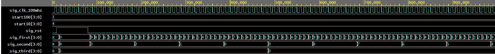
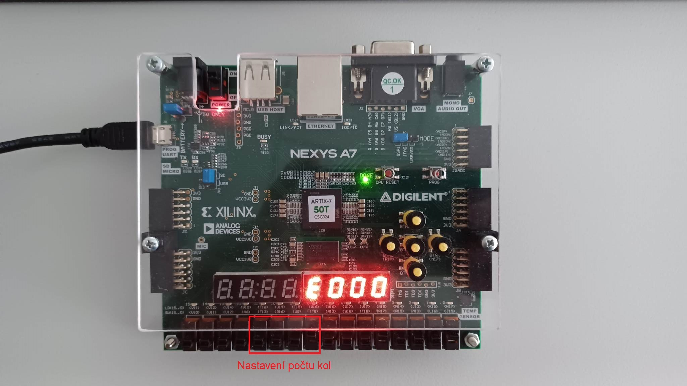

# Report z projektu: Čtvrtek - Časovač na kruhový trénink

### Členové týmu

* Buberník Frederic
* Jurkovič Martin

## Teoretický popis

Zadání znělo vytvořit časovač na kruhový trénink s možností nastavit počet kol, dobu kola a pauzy mezi nimi. To znamená, že budeme mít zobrazený odpočet kola, následně odpočet pauzy a takhle stále dokola, dokud neproběhne požadovaný počet kol. Naše řešení je principialně takové, že v prvotním stavu (tj. není na desce nic nastaveno) je doba kola 10 sekund, pauzy též 10 sekund a jedno kolo. Nastavení doby kola, pauzy i počtu kol je skrz 4-bitové vstupní hodnoty, kde každý bit pro nastavení jak kola, tak pauzy reprezentuje + 10 sekund. Pro počet to platí obdobně (tj. 1 bit = + 1 kolo). Maxilmáně tedy můžeme dosáhnout na 4-minuté kolo, 4-minutovou pauzu a 16 kol. Samotný odpočet se zobrazuje v sekundách.

## Hardware popis

Pro ovládání je využito 12 přepínačů a 1 tlačítko, výstup je zobrazen na sedmi-segmentovém displeji. První 4 přepínače (tj. 0 - 3) slouží pro nastavení doby kola, následující 4 přepínače jsou k nastavení doby pauzy a další 4 k nastavení počtu kol. Jedno prostřední tlačítko plní funkci resetu. Z možných 8 pozic na displeji jsou využívány čtyři. Levý z těchto čtyř slouží na identifikace (tj. jestli je aktuálně kolo, pauza nebo konec), zbylé 3 slouží pro samotný časový odpočet.

## Software popis

Put flowchats/state diagrams of your algorithm(s) and direct links to source/testbench files in `src` and `sim` folders. 

[Zdrojové soubory](/project/project/project.srcs/sources_1/new/)

[Simulační soubory](/project/project/project.srcs/sim_1/new/)

### Simulace komponentů a popis

* top - propojení programu s deskou
* timer - hlavní komponent, řídí celý chod aplikace
* countdown - generuje signál k zobrazení odpočtu
* clock_enable - zpomaluje řídící hodinový signál
* driver_7seg_4digits - převod hodnot k zobrazení na 7-segmentovém displeji
* hex_7seg - definování kombinací zobrazovaných na displeji
* cnt_up_down - čítač použitý v driver_7seg_4digits

### Simulace "coundown"

### Simulace "timer"

## Návod k ovládání

Po spuštění bude aplikace v jistém prvotním nastevní (tj. 1 10-sekundové kolo), ve kterém můžeme aplikaci nastavit podle našich preferencí.
* Přepínače 0 - 3 slouží k nastavení doby kola, jejich nastavením (hodnota je bráná binárně) přičteme k základním 10 sekundám dalších 10 sekund za každý bit.
* Přepínače 4 - 7 slouží k nastavení doby pauzy, jejich nastavením (hodnota je bráná binárně) přičteme k základním 10 sekundám dalších 10 sekund za každý bit.
* Přepínače 8 - 11 sloužík k nastavení počtu kol, jejich nastavením (hodnota je bráná binárně) přičteme k základu 1 kola další 1 kolo za každý bit.

Nyní stiskneme tlačítko reset, které nalezneme uprostřed všech tlačítek. Na displeji se poté zobrazí '9' na levé pozici, symbolizující 'g' jako go a započne odpočet 1. kola. Jakmile odpočet skončí zobrazí se na levé pozici 'P' jako "Pause" a odpočet pauzy. Tyto dva stavy se budou stále opakovat, až do posledního kola, kdy se na displeji zobrazí "E000", což nám signalizuje konec ('E' jako "End"). V tomto stavu aplikace zůstane, dokud nedojde ke stisku tlačítka reset, kdy se celý popsaný proces bude opakovat.

### Indikace kola

### Indikace pauzy

### Indikace konce

